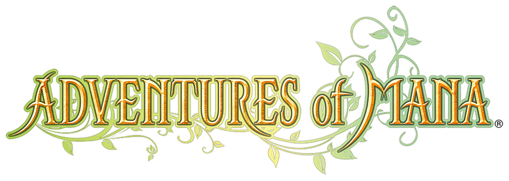

<h1 align=center>Adventure of Mana — Nintendo Switch port</h1>

This is a wrapper/port of the Android version of *Adventure of Mana*
(`com.square_enix.adventures` 1.1.4). It loads the
original game's native libraries and runs them inside a minimal emulated Android
environment.

### How to install

You're going to need the **`.apk`** for Adventure of Mana.
From it, extract:

* `lib/arm64-v8a/libmcfandroid.so` — the engine
* `lib/arm64-v8a/libc++_shared.so` — the C++ runtime
* the entire **`assets/`** folder (`sk1/sk1.mpk`, `sk1/sk1patch.mpk`,
  `bgm001_*.ogg` … `bgm130.ogg`, `cesa.png`, `save_data_icon.png`)

To install:

1. Create a folder called `aom` in the `switch` folder on your SD card.
2. Copy **`libmcfandroid.so`** and **`libc++_shared.so`** into `/switch/aom/`.
3. Copy the whole **`assets/`** folder into `/switch/aom/` (so you end up with
   `/switch/aom/assets/sk1/sk1.mpk`, etc.).
4. Copy **`aom_nx.nro`** into `/switch/aom/`.

So `/switch/aom/` should contain: `aom_nx.nro`, `libmcfandroid.so`,
`libc++_shared.so`, and `assets/` (with `sk1/` and the `bgm*.ogg` files).

### Notes

This will not work in applet/album mode. Use a game override (hold R on a title)
or a forwarder.

Save data and the port's `config.txt` are stored in `/switch/aom/`.

### Configuration

`config.txt` is created on first run:

* `screen_width` / `screen_height` — render resolution; `-1` picks 1280x720
  handheld and 1920x1080 docked.
* `language` — selects localized text/assets, in MCF order:
  `0` ja, `1` en, `2` fr, `3` de, `4` it, `5` es, `6` ko, `7` zh_CN, `8` zh_TW.
  Defaults to English.

### Controls

Nintendo-native layout (A confirms, B cancels). D-pad and the left stick both
drive movement; `L`/`R`/`ZL`/`ZR` map to the engine's L1/R1/L2/R2; `+`/`-` are
Start/Select; the touchscreen maps to the game's touch input.

### How to build

You're going to need devkitA64 and the following devkitPro packages:

* `switch-mesa`
* `switch-libdrm_nouveau`
* `switch-sdl2`
* `switch-freetype`
* `switch-libpng`
* `switch-harfbuzz`
* `switch-zlib`
* `switch-bzip2`

Then `make` (with `DEVKITPRO` set).

### Credits

* fgsfds for [max_nx](https://github.com/fgsfdsfgs/max_nx), which this loader is
  based on
* TheOfficialFloW for the original Vita ports that pioneered this technique

### Support

If you enjoy my work and want to support me :

### Legal

This project has no direct affiliation with Square Enix. "Adventure of Mana",
"Seiken Densetsu" and "Final Fantasy" are trademarks of their respective owners.
All Rights Reserved.

No assets or program code from the original game or its Android port are
included in this project. We do not condone piracy in any way, shape or form and
encourage users to legally own the original game.

Unless specified otherwise, the source code provided in this repository is
licensed under the MIT License. Please see the accompanying LICENSE file.
